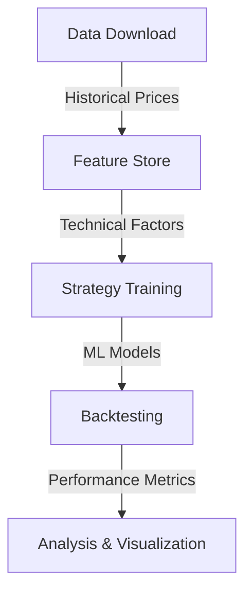
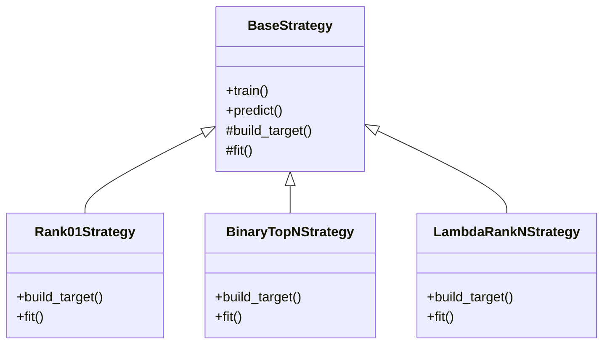

# Architecture Overview

## Data Flow

## Strategy Class Hierarchy

## Key Components

### Data Layer
- `data_download/`: Handles data acquisition from Polygon API
- `data_loading/`: Manages data loading and preprocessing
- `feature_store/`: Stores computed technical factors

### Strategy Layer
- `BaseStrategy`: Abstract base class for all strategies
- `Rank01Strategy`: Regression-based ranking strategy
- `BinaryTopNStrategy`: Binary classification for top N stocks
- `LambdaRankNStrategy`: Learning to rank with LambdaRank

### Backtesting Layer
- `BacktestAnalyzer`: Performance analysis and visualization
- `PurgedWalkForwardSplit`: Time series cross-validation
- Performance metrics: Sharpe ratio, drawdown, etc.

## Data Flow Details

1. **Data Collection**
   - Download historical price data from Polygon API
   - Store in partitioned parquet files

2. **Feature Engineering**
   - Compute technical indicators
   - Generate factor values
   - Store in feature store

3. **Strategy Training**
   - Load features from feature store
   - Train ML models with walk-forward CV
   - Save trained models

4. **Backtesting**
   - Load test data
   - Generate predictions
   - Calculate performance metrics

5. **Analysis**
   - Generate performance plots
   - Calculate risk metrics
   - Visualize results 